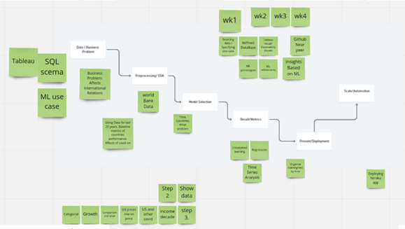

# Final Project Proposal: COVID BRICS
## Overview 
Using national income as the main criterion, the team will be looking into the economic performance of BRICS countries (Brazil, Russia, India, China, South Africa) and the US over the past 20 years and how COVID has had an effect on their development. The BRICS countries and the US collectively make up about half of the world's land mass as well as the world's population. *[enter exact numbers here]*. We will link that performance with access to key variables like electricity, water, health facilities, education and business climate. Finally, by using Machine Language we will make several projections in terms of the future incomes for these countries.

Additionally, the team will analyze the possibility of building a coffee processing facility in one of the BRICS countries. The team hopes this analysis will reveal which country has the most potential for building coffee processing factories as well as the potential for higher coffee consumption rates.

## Business Interest Analysis
The BRICS countries are either located in the places that are perfect for coffee bean growing, or located near the countries that largely consume coffee bean. So we are going to investigate the possibility of building coffee processing facilities in BRICS country. To develop ground coffee/instant coffee production line, we need to make sure the country can supply clean water, stable access to electricity and fast logistics.

We will use coffee consumption data, consumer price index data, covid cases data, electricity generation, and water supply data to find out which country has the potential to build coffee bean processing facility and which country would have the potential to consume the products.

The impact of covid pandemic to the coffee market will also be discussed.

## Why is this Important?
COVID has had a profound impact on the world economy. The team would like to investigate COVID’s long term economic effect on developing countries and compare that to the US, in hopes of identifying key factors most affected by pandemics, as well as predict the future state of the six aforementioned countries. 

## Description of Data Exploration Phase

### The Datasets 
 Coffee consumption data.
 -  International Coffee Organization. (2021, December). International Coffee Organization - Historical Data on the Global Coffee Trade. Retrieved January 20, 2022, from https://www.ico.org/new_historical.asp?section=Statistics 

 Consumer price index data.
 -  *[enter URL here- in Louise's branch]*
 
 COVID cases data.
 - John Hopkins University of Medicine. (2022). COVID-19 Map. Johns Hopkins Coronavirus Resource Center. Retrieved January 20, 2022, from https://coronavirus.jhu.edu/map.html

Electricity generation:
-  *[enter URL here - in main branch under "water and electricity" folder]* 

Water supply.
-  UNICEF. (2021, July 1). Access to drinking water. UNICEF DATA. Retrieved January 14, 2022, from https://data.unicef.org/topic/water-and-sanitation/drinking-water/

The datasets were taken from the World Bank and UNICEF. The datasets contained data from all countries in the world, so the team trimmed them in order to reflect information pertaining only to BRICS countries and the USA. 

## The Team
 ### Protocol for Pushing to GitHub
 All members will push their content to their branches first before pushing it into their main branch. In order to be pushed to the main branch, the content will have to be agreed upon all three members first.

 The three branches are as follows:
 - Chandra: "Chrandra"
 - Louise: "louiseyangbranch"
 - Eric: "EricStrobach"

  ## Team Member Roles
 - Louise will work on the coffee datasets and the coffee report established by the USDA. She will use machine learning to predict coffee consumption post-COVID. 
 - Chandra will use the World Bank dataset to analyze the GDP and inflation of BRICS countries, and will make predictions of GDP and inflation using unsupervised machine learning methodology. Will also create charts/maps on inflation.
 - Eric will also be using machine learning to analyze GDP and inflation of BRICS countries.

 - *(The team is still in the planning phase. Once the gameplan is decided, the team will assign additional specific roles to each member)*

The liner regression analysis will be performed on the coffee consumption/price and covid cases to see the relationship between the coffee market and pandemic. The linear regression analysis will also be used to predict the coffee consumption after covid.

Random Forest Regressor Model will be used in the prediction of energy and water supply.  

 Once the predictions are complete, the team will use Tableau to visualize their findings.

 ## Technologies, Languages, Tools, and Algorithms Used
 - Python
 - Machine Learning
 - Random Forest
 - Tableau
 - SQL Schema

 ## Results of Analysis
 *[Results will be entered here]*

 ## Recommendations for Future Analyisis
*[Recomendations will be entered here]*

## Project Plan
 